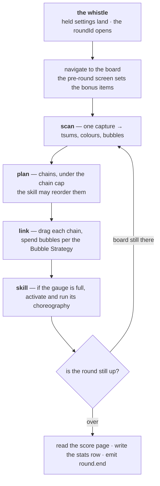

# Play loop

`taskPlayGameQuick` in `play.ts` is one round: the between-rounds delay, the
walk to the board, then **scan, link, skill** until the board stops answering.
The board itself — the scan, the chains, the bubbles — is `board.ts`; the chain
planning is `pathfinding.ts`; the skills are `skills/`. Those four files are
where the detail lives, and this page is only their shape.



## The walk in

The task returns early while a between-rounds delay is running, so the chores
keep their turns. Then comes **the whistle** — the last moment a setting can
still shape this round: settings held back by the Quick Bar land
(`quickBarApplyPending`), a new `roundId` opens, and `gPages.navigate` walks to
the board. On the way, the pre-round screen's handler sets the bonus items and
calls `openRound()`, which mints the round's id, freezes a copy of the settings
it is played under (`roundSettings`) and broadcasts `round.start`.

```ts reference title="app.gap.Tsum/src/play.ts"
https://github.com/TsumTsumScripts/tsum-tsum-script/blob/main/app.gap.Tsum/src/play.ts#L492-L551
```

## One turn of the loop

Each turn scans the board once, plans chains from what it saw, draws them, and
fires the skill if the gauge is ready — then asks whether the round is still
running and goes round again. Four things are worth knowing before changing any
of it:

- **The scan is the budget.** A capture is the expensive half of a turn, so the
  loop takes one per turn and everything else is read off it.
- **The chain cap comes from the settings unless the skill overrides it**
  through `chainLimits`, and a skill may reorder what gets linked
  (`orderPaths`). Neither is written back into the settings.
- **Bubbles are hoarded, not spent on sight.** They are worth more popped
  inside a chain, so the **Bubble Strategy** setting decides how many a chain
  may spend. A skill that makes its own bubbles declares `sweepsBubbles` or
  `claimsBubbles` rather than popping them behind the setting's back — see
  [Add a skill](../guides/add-a-skill).
- **Liveness is not a single reading.** A skill animation can cover the parts
  of the screen the check reads, so an unreadable frame is not proof the round
  ended; only a page a round can genuinely end on is.

The *Max round duration* setting can stop the script or **coast** — stop
playing and keep only the liveness check, so the round times out on its own and
the tally, the stats and the next round follow as usual.

## The end

On the turn the round is proven over, `watchRoundEnd` stamps `roundEndedAt` and
broadcasts `round.over`. The loop exits, `finishRoundStats` reads the score page
(template digit reading — the engine has no OCR) and writes the CSV row,
`round.end` goes out with the figures, and if a delay is configured the clock
for the next round starts from the game being back at the start screen.

<ImagePlaceholder id="board-chain-drawn" alt="The game board during a round, with one planned chain drawn over the tsums it links" />

<ImagePlaceholder id="score-page" alt="The post-round score page with the score, coins and medals the stats reader picks up" />

## Modes of the board

Two things change how a round is played without being screens:

- **Fever.** `fever.ts` reads it off its own probe table, debounces the answer
  and broadcasts start/end to subscribers (`gFever.subscribe`). The *No skill
  last fever seconds* setting is a hold-off `useSkill` honours.
- **The Lorcana transformation.** `lorcana.ts` watches the skill button change
  appearance, taps the card when it appears, and clears what each activation
  leaves behind. It is a setting rather than a skill, because every Lorcana
  tsum transforms the same way whatever its skill does.

## Reading a round afterwards

Every record in the round carries its `roundId`; `round.start` … `round.end`
carry the same `id`. The stats CSV (`stats/stats_<YYYYMMDD>.csv`) has one
row per round with the settings it was played under, read from the frozen
`roundSettings` copy — so a Quick Bar change made mid-round is written on the
*next* round's row, not this one's.
