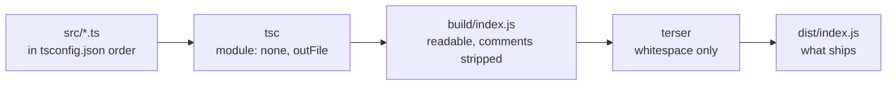

# The bundle

## There are no imports

Every `.ts` file under `src/` is concatenated, in the order listed in
`tsconfig.json`, into a single `build/index.js` that the host loads. All files
share **one global scope**: a `function` or `var` declared in `data.ts` is
simply visible in `play.ts`, with no `import` anywhere.



Two consequences to internalise:

- **Order in `tsconfig.json` matters — for load-time work only.** Anything that
  *executes as the bundle evaluates* (a top-level table, the `registerSkill(...)`
  calls in every skill file, `var gPages = new PageRouter()`) must be listed
  after what it depends on. Function declarations hoist across the whole bundle,
  so calls made *at runtime* are order-independent.
- **Name collisions are silent.** Two files declaring the same symbol will not
  error; the later one wins. `index.ts` is concatenated near the end and is
  deliberately kept thin for that reason.

The file list carries a comment per slot saying why it is where it is:

```jsonc reference title="app.gap.Tsum/tsconfig.json"
https://github.com/game-automation-platform/game-automation-scripts/blob/main/app.gap.Tsum/tsconfig.json#L31-L143
```

## `Tsum` is typed by declaration merging

`Tsum` is a `class` in `tsum.ts`, but **every one of its methods is attached
from outside the class body** as `Tsum.prototype.name = function ...`, spread
over twenty-odd files. With no modules a class cannot be reopened, and
splitting the object across files is the whole reason the package is not one
enormous file.

The two halves are joined by declaration merging: `interface Tsum` in
`globals.d.ts` declares every method, and TypeScript merges the interface into
the class of the same name. That is what makes `ts.foo()` checked and
find-referenceable across the bundle, lets each `Tsum.prototype.name =
function (...)` take its `this` and parameter types from the interface rather
than annotating them again, and turns a method defined under a name nothing
declares into an error.

**Adding a method to `Tsum` therefore means adding its signature to
`interface Tsum` as well.** The interface is grouped by the file that
implements each member:

```ts reference title="app.gap.Tsum/src/globals.d.ts"
https://github.com/game-automation-platform/game-automation-scripts/blob/main/app.gap.Tsum/src/globals.d.ts#L1077-L1093
```

The same idea one level down is why `Button`, `Page` and the log tables carry
**no type annotation**: a broad index signature would erase the key set, and
with it both go-to-definition and any chance of catching a misspelt key.
`Page` uses `satisfies PageMap`, which validates each entry without losing its
keys.

## The string vocabularies are `const enum`s

Several values are passed around as bare strings and are what most branching
tests. Each set is a `const enum`, and code refers to members, never to the
string:

| Enum | Declared in | Names |
|:--|:--|:--|
| `PageName` | `data.ts`, above the `Page` table | every screen the router can report |
| `SkillType` | `shared.d.ts` | every entry in the Skill Type dropdown |
| `SettingKey` | `shared.d.ts` | every setting; `interface Settings` is keyed from it, so the enum and the object that crosses the bridge are one list |
| `RecordKey`, `Locale` | `shared.d.ts` | the keys of `hearts.json`; the language tags |
| `Log` | `logEvents.ts` | every log event name, one enum per component inside a namespace |
| `Emit` | `scriptEvents.ts` | every event broadcast to outside tooling |
| `SkillReadiness`, `KeyCode` | `globals.d.ts` | the gauge read's answer; the host's key codes |

A const enum is erased at compile time, so it costs nothing at runtime, gives
each name one definition to jump to and rename, and — the reason it matters
here — is the only kind of shared constant that *can* span the three
compilations, since they share no memory.

A misspelt member is an error everywhere. A correctly spelled raw string still
compiles, so the rule is a convention reviewers hold: **use the member.**

## Three compilations

| Config | Output | Target | Shares |
|:--|:--|:--|:--|
| `tsconfig.json` | `build/index.js` — the game bundle | ES2023, `strict` | `shared.d.ts`, `logEvents.ts` |
| `tsconfig.settings.json` | `build/settings.js` — the settings page | ES5 (the WebView), looser | the above plus the page-side files: the string catalogues, the option lists, `presets.ts`, `runPlan.ts` |
| `tsconfig.quickbar.json` | `build/quickbar.js` — the Quick Bar page | ES5, `strict` | the same page-side files |

Only the first has a name an editor discovers automatically, so `settings.ts`
opens with `/// <reference>` lines that exist purely so a TypeScript language
server checks it against the right files. `npm run typecheck` runs these three and a fourth, `tsconfig.workflow.json`,
which proves `gapWorkflow.ts` compiles on its own.

## What ships is compacted, and only in ways that cannot change it

`tools/minify/minify.js` runs terser over both outputs with **`compress:
false` and `mangle: false`**: it parses and reprints without the formatting.
Nothing is renamed, inlined, folded or dropped. A script that runs unattended
for hours on a phone, with no source map and an error handler that logs
`String(e)`, cannot pay for a smaller file with a behaviour change.
`build/index.js` is left alone entirely so the offline tools and a stack trace
stay readable.

TypeScript is pinned to 6.x on purpose: 7 removes `outFile` and `module:
none`, and the no-imports design depends on both. Moving would mean a bundler
that emits a single IIFE and preserves global scope — a build migration, not a
config edit.
